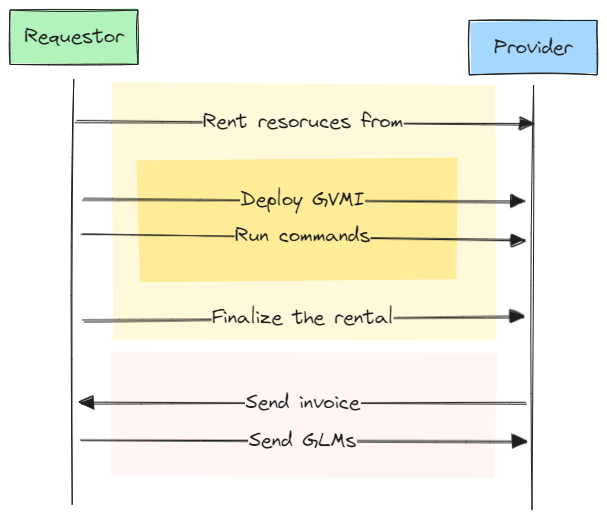
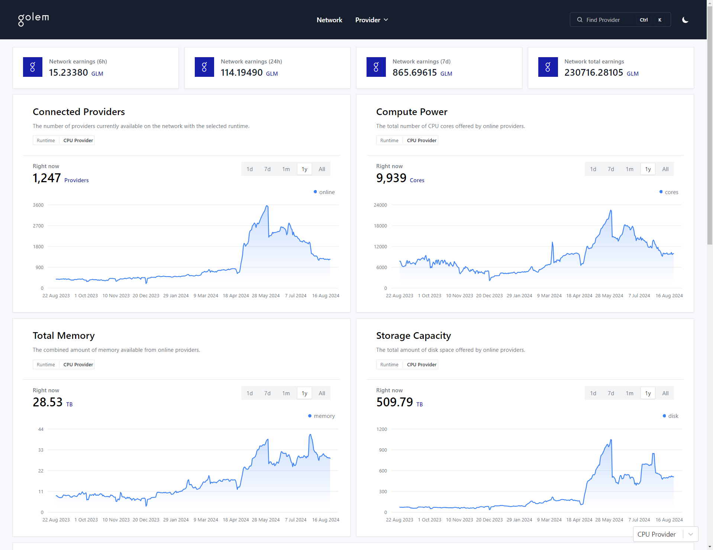

<style>
   img[alt~="center"] {
     display: block;
     margin: 0 auto;
   }

  strong {
    color: var(--heading-strong-color);
  }

  .hljs-comment {
    color: #ddd;
  }
</style>

# Harnessing Golem Network's Compute Power

## ETH Warsaw

05.09.2024, Warsaw


---


# About us

Grzegorz Godlewski

_Technical Lead_
_@ Golem Factory_

---


# About us

Jacek Laskowski

_Project Manager_
_@ Golem Factory_

--- 

# Software requirements

* Supported platform: `Windows`, `Linux`, `macOS`
* `node --version` min: `18` to build apps and requestor-scripts
* `docker` when you will be building GVMI for Golem Registry

---

# Agenda

* **Introduction** (_~20m_)
    * The Golem Network
    * Short Q&A

* **Workshop**  (_~90m_)
    * Start from scratch with the ecosystem
    * Rest break (_10m_)
    * Fast-forward to N-tier application

* **Q&A** session

---

# Follow along

[Source code of this presentation](https://github.com/golemfactory/golem-js-eth-warsaw-workshop)


---

# Part 1: Introduction to Golem Network

---

# Opening questions

* Who did hear about Golem Network?
* Who did try out Golem Network?

---

# What is Golem Network

* It's a P2P network where **Providers** and **Requestors** connect to exchange **compute resources** (the _value_) for
  cryptocurrency tokens (GLM, the _reward_).
* The **Creators** build solutions that the **Requestors** can leverage with resources from **Providers**.

---

# The Plot



---

# Compute Resources

- CPU
- GPU - limited availability
- Memory
- Storage
- Network (VPN, outbound, inbound)

---

# Networks

Golem Factory operates the following networks:

- `testnet`
- `mainnet`

---




---

# Part 2: Workshop

---

# Workshop Ground Rules

* 🆘 Ask for support when facing issues
* 🤝 Join or help your neighbour

---

# Lesson 1: Set-up

---

## Exercise: Installing the Golem Node

```bash
# Install the Golem Network package globally
npm install -g golem-network@latest

# Install the Golem Node software (yagna)
golem installer

# Start the Golem Node
golem daemon start

# Check general status
golem daemon status
```

---

## Exercise: Obtaining test funds and API keys

```bash
# Request funding with tGLM
yagna payment fund

# Check the current status of your funds
yagna payment status
  
# Create an api key, store the output
yagna app-key create eth-warsaw-workshop
# out: ec90...20e3

# You can retrieve the key later with 
yagna app-key list
```

---

## Exercise: Scan the `testnet` market

Use your app-key to scan the market

```bash
golem sdk market scan -k "ec90...20e3" --payment-network holesky
```

---

## Lesson 1 checklist

✅ You have Golem Node installed and running
✅ You obtained funds to work with test-net
✅ You created API key for later use
✅ You can see the offers in the `testnet`

---

# Lesson 2: Hello World

---

## Exercise: Creating first requestor script from template

```bash
# Prepare a directory for the workshop files
mkdir golem-workshop && cd golem-workshop

# Create a new project, use `js-node` for plain JS
golem sdk new learn-golem -t ts-node -y

# Build it
cd learn-golem && npm run build

# Provision configuration via ENV...
echo 'YAGNA_APPKEY=ec90...20e3' > .env

# ...and run the project
npm start
```

---

# Requestor Script structure review

---

## 📚 Key Information

* `GolemNetwork` as the high level entry-point
* `MarketOrderSpec` as a way of expressing the requirements
* `GolemNetwork.connect/disconnect` manages the lifecycle
* `GolemNetwork.manyOf/oneOf` help in working with rentals
* `ExeUnit` is an instance of a deployed image (like a started Docker container)
* `ExeUnit.run` allows executing arbitrary commands and resolves a `Result` object.
  > It's similar to `docker exec [container] [command]`, it ends when the spawned process terminates

---

## ⚠ Limitations

* You cannot run two commands simultaneously on the same activity (running container).

---

## Exercise: Modify the script

Objectives:

- Remove the part that uses `manyOf` and leave only the `oneOf` section
- Use the `golem/node:latest` image from the Golem Registry
- Obtain the node version from the provider `node --version` and display it on the screen

---

## Solution

```ts
// TODO
```

---

## Lesson 2 checklist

✅ You know about `connect/disconnect` and graceful error handling
✅ You know about the high level `oneOf/manyOf` features
✅ You know about Golem Registry
✅ You can switch between different images

---

# Lesson 3: Debugging

---

## Pretty logs

Enable pretty logging with `@golem-sdk/pino-logger`. Run:

```bash
npm install --save @golem-sdk/pino-logger
```

And update the code:

```ts
import {pinoPrettyLogger} from "@golem-sdk/pino-logger";

const logger = pinoPrettyLogger({
  level: "info",
});

const glm = new GolemNetwork({
  logger,
});
```

---

## Listen to specific events for debugging

Subscribe to certain events helping out in debugging:

```ts
glm.market.events.on("offerCounterProposalRejected", (event) => {
  logger.warn("My offer got rejected", {why: event.reason});
});
```

---

## DEBUG way

You can enable super verbose logs with `DEBUG` like this:

```bash
DEBUG="golem-js:*" npm start
```

---

## Lesson 3 checklist

✅ You know about the additional logging package
✅ You know about the existence of `.events`
✅ You know how to turn super verbose, low-level logging

---

# Lesson 4: Working with Compute Resources

---

## Memory and CPU

* You can use all the **memory** and **threads** offered out of the box
* Control the resource requirement via:
    - `order.demand.workload.minMemGib`
    - `order.demand.workload.minCpuThreads`
    - `order.demand.workload.minCpuCores`
    - 🌟TIP: Favour **threads** over **cores**
* GPU has a set of experimental properties to filter by

---

## Exercise: Specify resource requirements

Objectives:

- Update your script and specify requirements for CPU threads and memory.

```bash
node -e 'console.log({threads: os.availableParallelism(), memGib: os.freemem()/1024/1024/1024})'
```

---

## Storage

### 📚 Key Information

* Set requirements with `order.dmand.workload.minStorageGib`
* The image you are using needs to have a `VOLUME` defined to access the storage. Right now it's not possible to specify additional volumes at runtime.
* 🌟TIP: add `VOLUME /storage` to your
  images, [we did so for some of ours](https://github.com/golemfactory/golem-sdk-registry-images).
* 🌟TIP: **Download/backup your data** from the Provider to the Requestor - `ExeUnit.uploadFile/downloadFile`.

---

## Storage

### ⚠ Limitations

- The root filesystem mounted at `/` is only `128M`
- Storage in Golem is not persistent, all data persisted to disk will be lost after the Activity is terminated.

---

## Inspecting storage capacity

```
# df -h
Filesystem      Size  Used Avail Use% Mounted on
overlay         128M  8.0K  128M   1% /
devtmpfs        3.9G     0  3.9G   0% /dev
tmpfs           3.9G     0  3.9G   0% /tmp
tmpfs           3.9G     0  3.9G   0% /dev/shm
mnt0             99G   34G   61G  37% /storage
```

---

## Networking

In regard to networking, there are 3 distinct aspects:

- **VPN** for communication between the Golem Provider Nodes that you rent
- **Inbound** in case you want to make your Golem based solution available publicly
- **Outbound** in case your workloads running on Golem require internet access

---

PROVIDE THE IMAGE HERE, SIMPLE!

---

## Lesson 4 Checklist

✅ You know how CPU, threads and memory work on Golem
✅ You know about how Storage works on Golem and how to cope with that
✅ You know about networking options, their capabilities and constraints

---

# The Fast Forward

---

# The Workflow

- Develop
- Dockerize
- Golemize with `testnet`
- Move to `mainnet`

---

## Architecture

---

## Downloading the repo, building the project and running in docker

---

## Running the project on testnet, scaling the workers

---

# Resources: Documentation and examples

- [Golem Official Documentation](https://docs.golem.network/)
- [Golem Image Registry](https://registry.golem.network/explore)
- [`@golem-sdk/golem-js` on NPM](https://www.npmjs.com/package/@golem-sdk/golem-js)
- [Examples based on `golem-js`](https://github.com/golemfactory/golem-js/tree/master/examples)

---

# Resources: Reference implementations

## Libraries

- [@golem-sdk/task-executor](https://www.npmjs.com/package/@golem-sdk/task-executor) - _Task Model_ implementation
- [tesseract-ocr-golem](https://www.npmjs.com/package/tesseract-ocr-golem) - A complete OCR library that uses Golem as
  backend

## Applications

- [TaskExecutor + React Image Recognition App](https://github.com/golemfactory/golem-sdk-react/tree/master/examples/react-with-vite)
- [Music on Golem Full-Stack App](https://github.com/golemfactory/music-on-golem)

---

# Good Luck and Have Fun during the Hackathon!

---

# Appendix: VPN

## 📚 Key Information

- `GolemNetwork.createNetwork/destoryNetwork` to manage networks
- Pass the network as part of the `MarketOrderSpec`
- Obtain the node's IP using `ExeUnit.getIp`

## ⚠ Limitations

- No built-in DNS for locating providers within the VPN, leverage IPs to locate other nodes
- While technically you can have more networks, the `golem-js` SDK supports only 1 network at a time.

---

# Appendix: Inbound

## 📚 Key Information

- `ExeUnit.createTcpProxy` helps in building a TCP Server which will allow exposing a service running on Golem via the
  Provider node

## ⚠ Limitations

- Golem does not support direct inbound from the Internet, you have to expose a proxy

🌟TIP: It's good to wait for the service to become ready on Golem Network before starting your proxy

---

# Appendix: Outbound

## 📚 Key Information

- Three options: Whitelist, Signed Manifest, Partner Rule
- Whitelist https://github.com/golemfactory/ya-installer-resources/tree/main/whitelist

## ⚠ Limitations

- In case of HTTPs The Provider Host has to have the proper SSL certs installed to verify the cert-chain
- Not all providers have the whitelist populated

---

# Appendix: Outbound (continued)

```bash
# Create a manifest for the image you're going to use
golem sdk manifest create golem/node:latest

# Add NPM to the manifest
golem sdk manifest net add-outbound https://registry.npmjs.org
```

```ts
manifest: fs.readFileSync("./manifest.json").toString("base64");
```