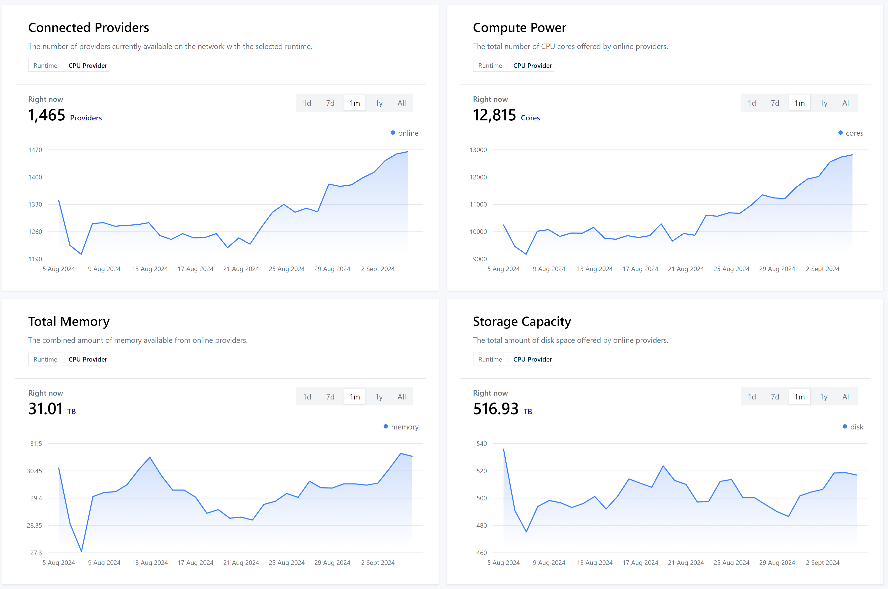

<style>
   img[alt~="center"] {
     display: block;
     margin: 0 auto;
   }

  strong {
    color: var(--heading-strong-color);
  }

  .hljs-comment {
    color: #ddd;
  }
</style>

# Harnessing Golem Network's Compute Power

Test Workshop (#2) 30.08.2024, Online
~~ETH Warsaw 05.09.2024, Warsaw~~

---


# About us

Grzegorz Godlewski

_Technical Lead_
_@ Golem Factory_

---


# About us

Jacek Laskowski

_Project Manager_
_@ Golem Factory_

--- 

# Software requirements

- Supported platform: `Windows`, `Linux`, `macOS`
- `node --version` min: `18`
- `docker`

---

# Agenda

* **Introduction** to Golem Network (_20m_)
 
* **Workshop**: From scratch to N-tier application (*) (_100m_)

* **Q&A**: At the end of Workshop. You can find us at the Golem booth or directly after the session.

---

# Follow along

[Source code of this presentation](https://github.com/golemfactory/golem-js-eth-warsaw-workshop)


---

# Part 1: Introduction to Golem Network

---

# Opening questions

- Who did hear about Golem Network?
- Who did try out Golem Network?

---

# What is Golem Network

> Golem Network **democratizes** society’s access to computing power by creating
> a **decentralized** platform where anyone can build a variety of applications,
> request computational resources and/or offer their idle systems in exchange for
> cryptocurrency tokens (GLM).

---

# The Plot

As modelled by
`@golem-sdk/golem-js`


---

# Architecture

* The **Provider** spins up a sandboxed runtime which will execute your workloads.
* The VMs are created using **Golem Virtual Machine Images** (GVMI for short), which are a derivative of a Docker Image.

---

# Compute Resources

* CPU
* GPU - limited availability
* Memory
* Storage
* Network - limited availability

---

# Runtime types

- CPU - `vm`
- GPU - `vm-nvidia`
- WASM - `wasmtime`

---

# Networks

Golem Factory operates the following networks:

- `testnet`
- `mainnet`

---

# Mainnet



---

# Goal of the workshop

_Learn how to **access** and **use** the resources offered by Providers on the Network_

---

# Part 2: Workshop

---

# Workshop Ground Rules

* 🙋‍♂️ Ask for support when facing issues
* 🆘 Decentralize help
  - 🤝 If things are not working for you, team-up with your neighbour
  - 🤝 If things are working for you, help your neighbour

---

# Lesson 1: Set-up

---

## Exercise: Installing the Golem Node

```bash
# Install the Golem Network package globally
npm install -g golem-network@latest

# Install the Golem Node software (yagna)
golem installer

# Start the Golem Node
golem daemon start

# Check general status
golem daemon status
```

---

## Exercise: Obtaining test funds and API keys

```bash
# Check the current status of your funds
golem yagna payment status

# Request funding with tGLM
golem yagna payment fund

# Create an api key, store the output
golem yagna app-key create eth-warsaw-workshop

# You can retrieve the key later with 
golem yagna app-key list
```

---

## Exercise: Scan the `testnet` market

```bash
golem sdk market scan -k your-app-key --payment-network holesky
```

---

## Lesson 1 checklist

- [ ] You have Golem Node installed and running
- [ ] You obtained funds to work with test-net
- [ ] You created API key for later use with the `YAGNA_APPKEY` environment variable

---

# Lesson 2: Hello World

---

## Exercise: Creating first requestor script from template

```bash
# Prepare a directory for the workshop files
mkdir golem-workshop && cd golem-workshop

# Create a new project, use `js-node` for plain JS
golem sdk new learn-golem -t ts-node -y

# Build it
cd learn-golem && npm run build

# Provision configuration via ENV...
echo 'YAGNA_APPKEY=your-app-key' > .env

# ...and run the project
npm start
```

---

# Requestor Script structure review

---

## 📚 Key Information

* `GolemNetwork` as the high level entry-point
* `MarketOrderSpec` as a way of expressing the requirements
* `GolemNetwork.connect/disconnect` manages the lifecycle 
* `GolemNetwork.manyOf/oneOf` help in working with rentals
* `ExeUnit` is an instance of a deployed image (like a started Docker container) - in Golem we call it an _activity_.
* `ExeUnit.run` allows executing arbitrary commands and resolves a `Result` object.
  > It's similar to `docker exec [container] [command]`, it ends when the spawned process terminates

---

## ⚠ Limitations

* You cannot run two commands simultaneously on the same activity (running container).

---

## Exercise: Modify the script

Objectives:

- Remove the part that uses `manyOf` and leave only the `oneOf` section
- Use the `golem/node:latest` image from the Golem Registry
- Obtain the node version from the provider `node --version` and display it on the screen

---

# Lesson 2 checklist


- [ ] You know about `connect/disconnect` and graceful error handling
- [ ] You know about the high level `oneOf/manyOf` features
- [ ] You know about Golem Registry
- [ ] You can switch between different images


---

# Lesson 3: Debugging

---

## All logs (super verbose!)

You can enable super verbose logs with `DEBUG` like this:

```bash
DEBUG="golem-js:*" npm start
```

---

## Pretty logs

Enable pretty logging with `@golem-sdk/pino-logger`. Run:

```bash
npm install --save @golem-sdk/pino-logger
```

And update the code:

```ts
import { pinoPrettyLogger } from "@golem-sdk/pino-logger";

const logger = pinoPrettyLogger({
  level: "info",
});

const glm = new GolemNetwork({
  logger,
});
```

---

## Listen to specific events for debugging

Subscribe to certain events helping out nin debugging:

```ts
glm.market.events.on("offerCounterProposalRejected", (event) => {
  logger.warn("My offer got rejected", { why: event.reason });
});
```

---

# Lesson 3: Memory & CPU Resources

---

### Memory and CPU

You can:

- Use all the memory and threads offered out of the box
- Control the memory resource requirement via `order.demand.workload.minMemGib`
- Control the CPU/threads resource requirement via:

  - `order.demand.workload.minCpuCores`
  - `order.demand.workload.minCpuThreads`

  * 🌟TIP: Favour **threads** over **cores**

---

## Exercise: Specify resource requirements

Objectives:

- Scan the market to learn about available resources.
- Update your script and specify requirements for CPU threads and memory.
- Display the name of the provider `ExeUnit.provider.name` to verify if you managed to get the one you were aiming for.

---

# Lesson 4: Storage

---

## Storage

### ⚠ Limitations

- The root filesystem mounted at `/` is only `128M`, the image you are using has to specify a `VOLUME`
- Storage is not persistent, all data persisted to disk will be lost after the Activity is terminated.

### 📚 Key Information

- The image you are using needs to have a `VOLUME` defined to access the storage. Right now it's not possible to specify
  additional volumes at runtime.
- 🌟TIP: add `VOLUME /storage` to your images, we did so for some of ours.
- 🌟TIP: **Download/backup your data** from the Provider to the Requestor.

---

## Inspecting storage capacity

```
# df -h
Filesystem      Size  Used Avail Use% Mounted on
overlay         128M  8.0K  128M   1% /
devtmpfs        3.9G     0  3.9G   0% /dev
tmpfs           3.9G     0  3.9G   0% /tmp
tmpfs           3.9G     0  3.9G   0% /dev/shm
mnt0             99G   34G   61G  37% /golem/work
mnt1             99G   34G   61G  37% /golem/output
mnt2             99G   34G   61G  37% /golem/input
```

---

## Exercise: Upload, execute and download

Objectives:

- Use `oneOf` to rent resources
- Upload a Node.js script to `/storage` using `ExeUnit.uploadFile`
- Execute the script to learn about the available resources, save the information in a file
- Download the `resources.json` file back to the Requestor using `ExeUnit.downloadFile`
- ~~🐛Place upload and download logic in `setup` and `teardown` callbacks.~~

---

## Lesson 3 checklist

- [ ] You know how to upload and download a file to the provider
- [🐛] ~~You know how to utilize `setup/teardown`~~

---

# Lesson 4: Networking

---

## Networking aspects

In regard to networking, there are 3 distinct aspcts:

- **VPN** for communication between the Golem Provider Nodes that you rent
- **Inbound** in case you want to make your Golem based solution available publicly
- **Outbound** in case your workloads running on Golem require internet access

---

## VPN

### 📚 Key Information

- `GolemNetwork.createNetwork/destoryNetwork` to manage networks
- Pass the network as part of the `MarketOrderSpec`
- Obtain the node's IP using `ExeUnit.getIp`

### ⚠ Limitations

- No built-in DNS for locating providers within the VPN, leverage IPs to locate other nodes
- While technically you can have more networks, the `golem-js` SDK supports only 1 network at a time.

---

## Exercise: Ping nodes

Objectives:

- Create a network
- Rent out 2 nodes that will be placed within these networks, use `golem/alpine:latest` image
- Obtain IP of the first node and ping it from the other one using the IP by sending a finite number of pings
  `ping -c 5 [ip]`
- Make sure that you clean up resources properly

---

## Inbound

### 📚 Key Information

- `ExeUnit.createTcpProxy` helps in building a TCP Server which will allow exposing a service running on Golem via the
  Provider node
- 🌟TIP: It's good to wait for the service to become ready on Golem Network before starting your proxy

### ⚠ Limitations

- ...

---

## Outbound

### 📚 Key Information

- Three options: Whitelist, Signed Manifest, Partner Rule
- Whitelist https://github.com/golemfactory/ya-installer-resources/tree/main/whitelist

### ⚠ Limitations

- In case of HTTPs The Provider Host has to have the proper SSL certs installed to verify the cert-chain
- Not all providers have the whitelist populated

---

```bash
# Create a manifest for the image you're going to use
golem sdk manifest create golem/node:latest

# Add NPM to the manifest
golem sdk manifest net add-outbound https://registry.npmjs.org
```

```typescript
manifest: fs.readFileSync("./manifest.json").toString("base64");
```

---

# Lesson X: Golem Virtual Images

---

# Lesson X: Switching to mainnet

⚠ GLM funding!

---

# The Workflow

- Develop
- Dockerize
- Golemize
- Go `testnet`
- Go `mainnet`

---

---

# Resources

- [Golem Official Documentation](https://docs.golem.network/)
- [Golem Image Registry](https://registry.golem.network/explore)

---

# Resources: Reference implementations

## Libraries

- [@golem-sdk/task-executor](https://www.npmjs.com/package/@golem-sdk/task-executor)
- [tesseract-ocr-golem](https://www.npmjs.com/package/tesseract-ocr-golem)

## Applications

- [TaskExecutor based React App](https://github.com/golemfactory/golem-sdk-react)
- [Music on Golem Full-Stack App](https://github.com/golemfactory/music-on-golem)

# Good Luck and Have Fun!
